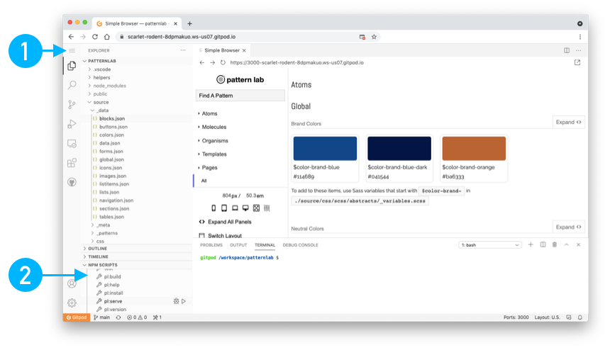

# How to use Pattern Lab with Gitpod 

(aka Pattern Lab the Easy Way)

## What is Gitpod?

Gitpod is a cloud-based service that will let you build and run software directly from within the GitHub repository where that code is maintained — without needing to install anything on your computer! Gitpod creates a virtual workspace that looks and works almost exactly like VS Code, only it's all in your web browser. You can edit your project files and commit changes back to your repo. You can pause your workspace and restart it when you're ready to do more work on your project and you can share your workspace to collaborate with teammates in real time. Gitpod is free for up to 100 hours of use each month.

## Getting Started

If you're planning to use Pattern Lab to develop and manage your pattern libraries we recommend that you fork this repository first (and change the url in the big blue button in the next section).

If you're taking our [course](https://thegymnasium.com/courses/course-v1:GYM+014+0/about) and you want to get straight into learning how to use Pattern Lab without having to deal with installing a million things first, then...

## 1. Launching a Workspace

- Click this 
- You will be redirected to the Gitpod site where you'll be prompted to log in using your GitHub account
- Sit back and watch while Gitpod creates a workspace for your project and installs Pattern Lab

### Notes: 
- The first time Gitpod creates the workspace it may take a few minutes
- You can ignore any of the warnings about some of the npm packages as they're getting installed
- You're ready to use Pattern Lab as soon as the terminal window in Gitpod shows this prompt: `gitpod /workspace/patternlab $ `

##  2. Starting Pattern Lab

- Locate the tool palette on the lower left-hand side of your workspace window that is titled "NPM SCRIPTS" and click the triangular icon that appears when you hover your cursor over the "pl:serve" item
- Alternatively, you can type the command `npm run pl:serve` into the terminal window in your workspace and press <kbd>Return</kbd> to run Pattern Lab
- Pattern Lab's interface will appear in a new browser tab

## 3. Stopping (and Restarting) a Workspace

- You don't _really_ need to manually stop your workspace, you can just close your browser window
- Workspaces that are inactive for 30 minutes are automatically stopped
- To manually stop the workspace, locate the Application Menu on the upper left-hand side of your workspace window and select "Gitpod: Stop Workspace"
- To restart a workspace, find it on [your Gitpod dashboard](https://gitpod.io/workspaces) and select "Open" from the function menu for that workspace

## 4. Saving Your Work

- Any changes made to files in a workspace are automatically saved with that workspace
- You can commit your changes to your own fork of this repository
- You can download the workspace and its files from [your Gitpod dashboard](https://gitpod.io/workspaces)
- **NOTE:** Gitpod retains active (and pinned) workspaces indefinitely, but purges inactive ones after 14 days

   
   

**1.** Gitpod Application Menu

**2.** NPM Scripts palette

